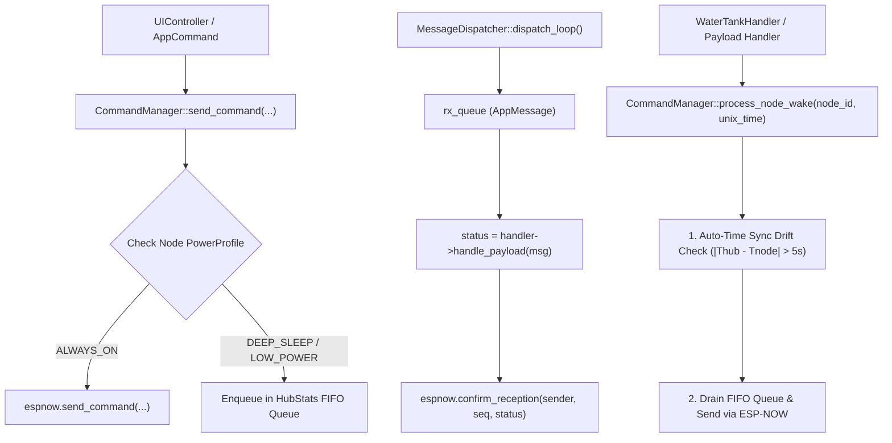

# CommandManager & Multi-Command FIFO Queue Implementation Plan

## 1. Overview & Objectives

This plan addresses **Issues #5 and #6** (and aligns with **Issue #4**) from [`todo/issues.md`](file:///home/german/dev/workspaces/smart-farm/smart-farm-hub/todo/issues.md#L23-L38):

1. **Centralized Command Dispatcher (`CommandManager`)**: Create a unified command manager responsible for dispatching commands (instant for `ALWAYS_ON` nodes vs queued FIFO for `DEEP_SLEEP`/`LOW_POWER` nodes), checking clock drift, and auto-arming `SYNC_TIME`.
2. **Multi-Command Queue per Node (Issue #5)**: Expand `HubStats` to maintain a fixed FIFO queue of up to 3-4 commands per `NodeId` with NVS/RTC persistence.
3. **Payload Handler Decoupling (Issue #6)**: Update `IPayloadHandler::handle_payload` to return `espnow::AckStatus`, moving `confirm_reception` to `MessageDispatcher` and removing `espnow::IEspNowManager` dependencies from payload handlers.
4. **IDF Primitive Clean-up**: Replace direct `#include "esp_timer.h"` calls in `WaterTankHandler` with `idf_hals::ITimerHAL`.

---

## 2. Architecture & Data Flow

---

## 3. Detailed Component Plan

### Phase 1: `IPayloadHandler` & `MessageDispatcher` Refactoring
- **`main/include/interfaces/i_payload_handler.hpp`**:
  * Change signature: `virtual espnow::AckStatus handle_payload(const espnow::AppMessage& msg) = 0;`
- **`main/src/message_dispatcher.cpp` & `.hpp`**:
  * Inject `espnow::IEspNowManager&` into `MessageDispatcher`.
  * After executing `status = handler->handle_payload(msg)`, if `msg.requires_ack` is `true`, call `espnow_.confirm_reception(msg.sender_id, msg.sequence_number, status)`.

### Phase 2: `HubStats` Multi-Command FIFO Queue (Issue #5)
- **`main/include/hub_stats.hpp`**:
  * Define `MAX_PENDING_PER_NODE = 4`.
  * Update `PendingNodeCommand` array to `PendingNodeCommand pending_cmds[MAX_HUB_NODES][MAX_PENDING_PER_NODE]`.
  * Provide helper methods `push_pending(node_id, cmd, ack)`, `pop_pending(node_id, out_cmd)`, `has_pending(node_id)`, `clear_pending(node_id)`.
  * Update `HubStats::operator==`, `operator!=`, and `reset()`.
- **`main/src/hub_nvs.cpp`**:
  * Ensure NVS load/save functions handle the multi-slot array safely.

### Phase 3: `CommandManager` Implementation (Issue #4, #5 & #6)
- **Files**: `main/include/command_manager.hpp` and `main/src/command_manager.cpp`.
- **Dependencies**: `espnow::IEspNowManager&`, `HubStats&`, `IHubNvs&`, `time_manager::ITimeManager&`, `SystemState&`, `SemaphoreHandle_t`.
- **Key Methods**:
  * `bool send_command(farm::NodeId target_node, espnow::CommandType cmd, bool requires_ack)`: Instant send if `ALWAYS_ON`, otherwise enqueues to FIFO.
  * `void process_node_wake(farm::NodeId node_id, uint64_t node_unix_time_ms)`: Performs auto-time-sync check ($|T_{\text{hub}} - T_{\text{node}}| > 5000\text{ ms}$) and drains the pending FIFO queue for `node_id`.
  * `void check_and_arm_time_sync(farm::NodeId node_id, uint64_t node_unix_time_ms)`.
  * `void dispatch_pending_commands(farm::NodeId node_id)`.

### Phase 4: Payload Handlers Refactoring
- **`WaterTankHandler`**:
  * Remove `stats_`, `hub_storage_`, `espnow_`, `time_manager_` dependencies.
  * Inject `CommandManager&` and `idf_hals::ITimerHAL& timer_`.
  * Replace `esp_timer_get_time()` with `timer_.get_time_us() / 1000`.
  * Update `handle_payload()` to return `espnow::AckStatus::OK` or `ERROR_INVALID_DATA`.
- **`OtaStatusHandler`** and **`RequestTimeSyncHandler`**:
  * Remove `confirm_reception` calls and return `espnow::AckStatus::OK`.

### Phase 5: Application Integration (`HubApp`, `UIController`, `main.cpp`)
- **`HubApp`**: Delegate `handle_app_command` to `CommandManager::send_command`.
- **`main.cpp`**: Instantiate `CommandManager`, inject into `HubApp`, `MessageDispatcher`, and `WaterTankHandler`.

---

## 4. Verification & Testing Strategy

1. **Host Tests (`host_test`)**:
   * Add new test suite `test_command_manager.cpp` in `host_test/test_hub/main/` testing:
     - FIFO enqueuing and draining (capacity limits, ordering).
     - Hybrid dispatch logic (`ALWAYS_ON` vs `DEEP_SLEEP`).
     - Clock drift detection and automatic `SYNC_TIME` arming.
2. **Build Verification**:
   * Compile project with target `esp32s3` to ensure zero warnings or ABI/NVS layout issues.
