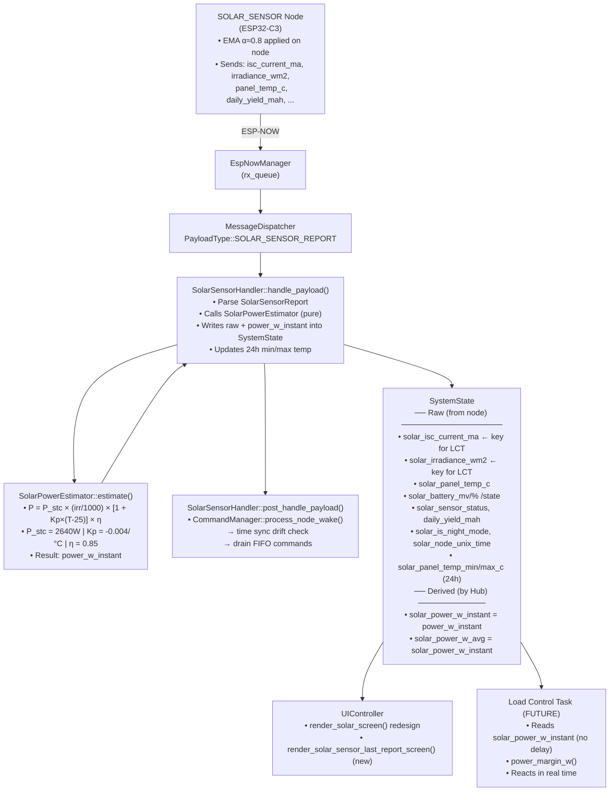

# Solar Sensor Integration Plan — `smart-farm-hub`

## Goal

Integrate the `SOLAR_SENSOR` node into the Hub: create the payload handler, expand `SystemState` with raw and derived sensor data, redesign `SOLAR_SCREEN`, add the last report screen, and prepare the infrastructure for the future **Load Control Task** without requiring significant refactoring later.

---

## SRP Design Decision — Who computes the derived data?

`SolarSensorHandler` is a **protocol handler**: its responsibility is to deserialize and route. Estimating power from physical data (`irradiance_wm2`, `panel_temp_c`, `isc_current_ma`) is **domain logic** that changes for independent reasons (calibration, cell model, panel coefficients).

**Adopted separation:**

```
SolarSensorHandler          →  "process ESP-NOW message"
    ↓ calls
SolarPowerEstimator         →  "PV physics: estimate installation power (pure function)"
    ↓ returns SolarPowerEstimate { power_w_instant }
SolarSensorHandler          →  writes raw + estimate into SystemState
                               + notifies EventGroup g_solar_events
```

**`SolarPowerEstimator`** is a pure function (no state, no I/O):
- Testable in isolation without any mock
- Reusable by the Load Control Task if it needs to recalculate
- Evolves independently (calibration, panel coefficients)

**No EMA in the Hub:** EMA on the node is **sensor-noise filtering** (INA jitter), not control policy. Moving it to the Hub would mix responsibilities: the Hub should not need to know that the sensor has noise. With α≈0.8, the node already reacts quickly (80% weight on the new reading). Additional smoothing in the Hub would delay the reaction and would be dangerous in a batteryless system.

---

## Final Decisions

| #   | Question                    | Decision                                                                                                                                 |
| --- | --------------------------- | ---------------------------------------------------------------------------------------------------------------------------------------- |
| Q1  | Installed capacity          | **8 × 330W = 2640W** (8S, polycrystalline). See [photovoltaic_panels_data.md](docs/photovoltaic_panels_data.md)                          |
| Q2  | Min/Max temp: persistence?  | **Volatile in `SystemState`**, relative to the last 24h (resets on reboot)                                                               |
| Q3  | Smoothing in the Hub?       | **None.** EMA stays on the node (sensor noise = sensor responsibility). Hub reacts to the latest filtered signal.                        |
| Q4  | Obsolete fields             | Remove `solar_voltage_mv`, rename `solar_current_ma` → `solar_isc_current_ma`                                                            |
| Q5  | EMA on node or Hub?         | **On the node.** Filtering policy belongs to the sensor. Changes via node OTA. Hub adds no latency.                                      |
| Q6  | Potential daily production? | **Yes:** `solar_daily_yield_wh_hub` accumulated by the Hub on each report. Enables future cross-checking with actuator load consumption. |

> [!IMPORTANT]
> **No additional smoothing in the Hub.** Batteryless system: consumption > generation → inverter shuts everything down. The Load Control Task MUST react to the latest signal, not to an average.

---

## Design Decision — SystemState vs. Dedicated Queue for Load Control Task (LCT)

**Question raised:** Is `SystemState` the ideal carrier for the LCT, or does it create overhead by carrying many unrelated fields and requiring a mutex?

---

### Architectural Comparison

#### 1. Dedicated Queue (`QueueHandle_t lct_queue`)
- **How it would work:** `SolarSensorHandler` and future `LoadHandlers` package events into small structs (`SolarEvent`, `LoadEvent`) and send them with `xQueueSend(lct_queue, &evt, 0)`. The LCT consumes them with `xQueueReceive`.
- **Advantages:**
  - Zero mutex dependency in the LCT loop.
  - Pure and chronological event-driven flow.
- **Disadvantages and risks:**
  - **State duplication and drift risk:** The LCT needs to keep a local cache of each load's consumption. If an event is dropped (queue full) or a node restarts without the Hub knowing, the LCT local cache diverges from the real state.
  - If the LCT needs additional contextual data (for example, sensor battery status, night mode, protection flags), the event struct starts to grow, or the LCT ends up having to read `SystemState` anyway.

#### 2. `SystemState` as SSOT + Reactive Wake (`TaskNotify` / `EventGroup`)
- **How it would work:** Handlers update `SystemState`. Immediately after releasing the mutex, they trigger a direct notification (`xTaskNotifyGive` or `xEventGroupSetBits`). The LCT wakes instantly, acquires the mutex, takes a **snapshot copy** of only the ~16-32 bytes relevant to the energy balance, releases the mutex, and executes the decision logic.
- **Overhead and contention analysis:**
  - **Memory overhead:** In C++, accessing a field in a large struct is resolved at compile time as a direct offset (`base_ptr + offset`, one `ldr` assembly instruction). There is no overhead for unused fields.
  - **Mutex contention:** A 32-byte snapshot copy under mutex consumes **less than 2 microseconds** of CPU (at 240MHz).
  - **Preventing UI blocking:** The UI task follows the FreeRTOS golden rule: *Fast snapshot under mutex -> Release mutex -> Render on display*. That way, the UI never holds the mutex during the display I2C/SPI transmission.
- **Advantages:**
  - **Single Source of Truth:** The real system state never diverges.
  - **Scales with multiple nodes/loads:** When load nodes (fridge, pump, freezer) arrive, their handlers only need to update their respective entries in `SystemState::loads[]` and notify the LCT through the same mechanism.
  - **Zero intermediate allocation.**

---

### Decision & Interface Adopted for This Stage

1. **`SystemState` remains the single source of truth.**
2. `SolarSensorHandler` optionally receives a notification primitive (`EventGroupHandle_t solar_events` or task pointer). If present, it fires the event **after** `rtos_.semaphore_give(state_mutex_)`.
3. When the LCT is implemented, it will:
   - Block waiting for the event (wake in < 10 µs).
   - Take a fast copy of the solar-vs-load balance.
   - Decide immediate load shedding/resume actions without risking mismatched data.

---

---

## Architecture — Data Flow



---

## User Review Required

> [!WARNING]
> **Fields `solar_voltage_mv` and `solar_current_ma` removed/renamed in `system_state.hpp`**
> The current `render_solar_screen` uses these fields. They will be replaced. The screen will be completely redesigned.

> [!NOTE]
> **`hub_stats.hpp` — No changes (VERSION 6 kept)**
> `SystemState` is not persisted. Solar data is volatile and resets on reboot. The node always resends the current state in the next report.

---

## Proposed Changes

### ── 1. Hub Configuration ──────────────────────────────────────────────

#### [NEW] `main/include/hub_config.hpp`

Constants based on the real panel data ([photovoltaic_panels_data.md](docs/photovoltaic_panels_data.md)) and sensor data.

```cpp
#pragma once
#include <cstdint>

namespace hub::config {

// ── Solar System Parameters ──────────────────────────────────────
/// Installed solar capacity at STC (1000 W/m²) in Watts.
/// 8 panels × 330W = 2640W (8S configuration, polycrystalline).
/// Source: photovoltaic_panels_data.md
static constexpr uint16_t SOLAR_INSTALLED_CAPACITY_W = 2640;

/// Pmax temperature coefficient per °C.
/// Polycrystalline panels: typical -0.40%/°C = -0.004 /°C.
static constexpr float SOLAR_TEMP_COEFF_PER_C = -0.004f;

/// Overall system efficiency factor (inverter + wiring losses).
/// Conservative estimate: 0.85 (85%). Calibrate in field.
static constexpr float SOLAR_SYSTEM_EFFICIENCY = 0.85f;

/// Reference sensor cell Isc at STC (mA).
/// Sensor panel Isc = 0.60A = 600mA. Source: photovoltaic_panels_data.md
/// Reserved for future cross-check / dual-estimation validation.
static constexpr float SOLAR_REF_CELL_ISC_STC_MA = 600.0f;

// ── Load Control Thresholds (for future Load Control Task) ───────
static constexpr uint16_t LOAD_SAFETY_MARGIN_W = 50;   ///< Below: shed loads
static constexpr uint16_t LOAD_RESUME_MARGIN_W = 150;  ///< Above: resume loads

} // namespace hub::config
```

---

### ── 2. SystemState — Solar Expansion ────────────────────────────────

#### [MODIFY] `main/include/system_state.hpp`

The `// ─── Solar Generation` section is fully replaced:

```diff
-    // ─── Solar Generation ────────────────────────────────────────────
-    int64_t last_solar_update_ts = 0;
-    uint16_t solar_voltage_mv = 0;
-    uint16_t solar_current_ma = 0;
-    uint16_t solar_power_w_instant = 0; ///< Interpolated solar array AC power in Watts
-    uint16_t solar_power_w_avg = 0;     ///< Moving average of solar array AC power in Watts

+    // ─── Solar Sensor Node ───────────────────────────────────────────
+    int64_t  last_solar_update_ts = 0;      ///< ms since boot (0 = never)
+
+    // Raw fields from SolarSensorReport (node-filtered, EMA α≈0.8 applied on node)
+    uint16_t solar_isc_current_ma  = 0;     ///< Ref cell short-circuit current (mA). Primary signal for LCT.
+                                            ///< Spec: 600mA @ 1000 W/m², 25°C (STC)
+    uint16_t solar_irradiance_wm2  = 0;     ///< Estimated solar irradiance (W/m²). Primary signal for LCT.
+    int16_t  solar_panel_temp_c    = INT16_MIN; ///< Panel temp in 0.1°C. INT16_MIN = sensor absent.
+    uint16_t solar_battery_mv      = 0;     ///< Sensor node battery voltage (mV)
+    uint8_t  solar_battery_percent = 0;     ///< Sensor node battery level (0–100)
+    farm::BatteryState solar_battery_state = farm::BatteryState::UNKNOWN;
+    farm::SensorStatus solar_sensor_status = farm::SensorStatus::UNKNOWN;
+    uint16_t solar_max_current_ma  = 0;     ///< Peak Isc of current day (from node, for display)
+    uint32_t solar_daily_yield_mah = 0;     ///< Daily yield integral from node (mAh, display only)
+    bool     solar_is_night_mode   = false;
+    uint64_t solar_node_unix_time  = 0;     ///< UTC epoch from node (0 = not synced)
+
+    // Hub-computed fields (derived by SolarSensorHandler via SolarPowerEstimator)
+    // Formula: P = P_stc(2640W) × (irr/1000) × [1 + Kp×(T-25)] × η(0.85)
+    uint16_t solar_power_w_instant = 0;     ///< Estimated AC power of installation (W). Primary for LCT.
+    uint16_t solar_power_w_avg     = 0;     ///< Alias for solar_power_w_instant (no hub-side smoothing).
+                                            ///< Field kept for API compatibility with future LCT.
+
+    // Hub-accumulated daily energy estimate (volatile, reset on reboot ~= last 24h)
+    float    solar_daily_yield_wh_hub = 0.0f; ///< Σ(power_w_instant × Δt_h) per report.
+                                              ///< Cross-reference with load consumption for efficiency.
+
+    // Hub-tracked daily temperature range (volatile, reset on reboot ~= last 24h)
+    int16_t  solar_panel_temp_max_c = INT16_MIN; ///< Daily max panel temp (0.1°C)
+    int16_t  solar_panel_temp_min_c = INT16_MAX; ///< Daily min panel temp (0.1°C)
```

Add helpers:
```cpp
bool is_solar_night() const { return solar_is_night_mode; }

bool is_solar_data_fresh(int64_t now_ms, uint32_t max_age_ms) const {
    return last_solar_update_ts > 0 &&
           (now_ms - last_solar_update_ts) < static_cast<int64_t>(max_age_ms);
}
```

---

### ── 3. i18n — New Strings ─────────────────────────────────────────

#### [MODIFY] `main/include/i18n/language.hpp`

```diff
     SETTINGS_PAIRING,
     SETTINGS_PAIRING_ACTIVE,

+    // Solar Sensor Screen
+    HEADER_SOLAR_REPORT,     ///< Last report screen header
+    SOLAR_LABEL_IRRADIANCE,  ///< "Irradiance" label
+    SOLAR_LABEL_ISC,         ///< "Isc" current label
+    SOLAR_LABEL_TEMP,        ///< "Panel Temp" label
+    SOLAR_LABEL_YIELD,       ///< "Yield" label
+    SOLAR_LABEL_NIGHT,       ///< "Night" mode label
+
     COUNT
```

#### [MODIFY] `main/include/i18n/strings_en.hpp` / `strings_pt.hpp`

```cpp
// EN
"[SOL] LAST REPORT",  // HEADER_SOLAR_REPORT
"Irradiance",         // SOLAR_LABEL_IRRADIANCE
"Isc",                // SOLAR_LABEL_ISC
"Panel Temp",         // SOLAR_LABEL_TEMP
"Yield",              // SOLAR_LABEL_YIELD
"Night",              // SOLAR_LABEL_NIGHT

// PT
"[SOL] ULT. REPORT",
"Irradiancia",
"Isc",
"Temp Painel",
"Producao",
"Noite",
```

---

### ── 4a. SolarPowerEstimator — PV Domain Logic ────────────────

**SRP:** Power estimation is domain physics, independent from the protocol.
It changes for different reasons (calibration, temperature model, panel coefficients).
Separated from the handler → testable in isolation, without any mock.

#### [NEW] `main/include/solar_power_estimator.hpp` (header-only)

```cpp
#pragma once
#include <cstdint>
#include <climits>
#include "farm_protocol_types.hpp"
#include "hub_config.hpp"

namespace hub::solar {

struct SolarSystemConfig {
    uint16_t installed_capacity_w;  ///< Nominal power at STC (1000 W/m²) in Watts
    float    temp_coeff_per_c;      ///< Pmax temperature coefficient (/°C). Typical: -0.004
    float    system_efficiency;     ///< Overall system efficiency (0.0–1.0). Typical: 0.85
    float    ref_cell_isc_ma;       ///< Reference cell Isc at STC (mA). For cross-check only.
    float    stc_temp_c;            ///< STC reference temperature. Default: 25.0°C

    static SolarSystemConfig from_hub_config() {
        return {
            .installed_capacity_w = config::SOLAR_INSTALLED_CAPACITY_W,
            .temp_coeff_per_c     = config::SOLAR_TEMP_COEFF_PER_C,
            .system_efficiency    = config::SOLAR_SYSTEM_EFFICIENCY,
            .ref_cell_isc_ma      = config::SOLAR_REF_CELL_ISC_MA,
            .stc_temp_c           = 25.0f,
        };
    }
};

struct SolarPowerEstimate {
    uint16_t power_w_instant;       ///< Estimated AC power output of the solar installation (W)
    uint16_t irradiance_wm2;        ///< Irradiance used for calculation (W/m²)
};

/// @brief Estimate solar installation power from sensor raw data.
///
/// Formula (IEC 61853 simplified):
///   P = P_stc × (irradiance / 1000) × [1 + Kp × (T_panel - T_stc)] × η_system
///
/// If panel_temp_c == INT16_MIN (no sensor), temperature correction is skipped.
/// Result is clamped to [0, UINT16_MAX].
///
/// @note isc_current_ma is currently unused in this calculation but carried
///       through for future cross-check / dual-estimation validation.
inline SolarPowerEstimate estimate(
    const farm::SolarSensorReport& report,
    const SolarSystemConfig& cfg = SolarSystemConfig::from_hub_config())
{
    // Night mode or zero irradiance → no generation
    if (report.is_night_mode || report.irradiance_wm2 == 0) {
        return {0, 0};
    }

    // Base: P_stc scaled by irradiance
    float power = static_cast<float>(cfg.installed_capacity_w)
                * (static_cast<float>(report.irradiance_wm2) / 1000.0f);

    // Temperature derating (only if sensor present)
    if (report.panel_temp_c != INT16_MIN) {
        float temp_c = static_cast<float>(report.panel_temp_c) / 10.0f;
        power *= (1.0f + cfg.temp_coeff_per_c * (temp_c - cfg.stc_temp_c));
    }

    // System efficiency (wiring, inverter losses, etc.)
    power *= cfg.system_efficiency;

    // Clamp to valid uint16_t range
    if (power < 0.0f) power = 0.0f;
    if (power > static_cast<float>(UINT16_MAX)) power = static_cast<float>(UINT16_MAX);

    return {
        .power_w_instant = static_cast<uint16_t>(power),
        .irradiance_wm2  = report.irradiance_wm2,
    };
}

} // namespace hub::solar
```

**New fields in `hub_config.hpp`:**
```diff
+static constexpr float   SOLAR_TEMP_COEFF_PER_C     = -0.004f;  ///< -0.4%/°C (typical monocrystalline)
+static constexpr float   SOLAR_SYSTEM_EFFICIENCY     = 0.85f;    ///< Inverter + wiring losses
+static constexpr float   SOLAR_REF_CELL_ISC_MA       = 500.0f;   ///< Reference cell Isc at STC (mA) — TO CALIBRATE
```

---

### ── 4b. SolarSensorHandler — Protocol Handler ──────────────────

**SRP:** Deserializes payload, calls `SolarPowerEstimator`, writes into `SystemState`, maintains EMA.

#### [NEW] `main/include/handlers/solar_sensor_handler.hpp`

```cpp
#pragma once
#include "command_manager.hpp"
#include "farm_protocol_types.hpp"
#include "interfaces/i_hal_freertos.hpp"
#include "interfaces/i_hal_timer.hpp"
#include "interfaces/i_payload_handler.hpp"
#include "solar_power_estimator.hpp"
#include "system_state.hpp"

namespace hub {

class SolarSensorHandler : public IPayloadHandler
{
public:
    SolarSensorHandler(
        SystemState&              state,
        SemaphoreHandle_t         state_mutex,
        CommandManager&           command_mgr,
        idf_hals::ITimerHAL&     timer,
        idf_hals::IHalFreertos&  rtos,
        EventGroupHandle_t        solar_events,           ///< g_solar_events — notifies Load Control Task
        solar::SolarSystemConfig  solar_cfg = solar::SolarSystemConfig::from_hub_config());

    espnow::AckStatus handle_payload(const espnow::AppMessage& msg) override;
    void              post_handle_payload(const espnow::AppMessage& msg) override;

private:
    SystemState&              state_;
    SemaphoreHandle_t         state_mutex_;
    CommandManager&           command_mgr_;
    idf_hals::ITimerHAL&     timer_;
    idf_hals::IHalFreertos&  rtos_;
    EventGroupHandle_t        solar_events_;  ///< Notification for Load Control Task
    solar::SolarSystemConfig  solar_cfg_;
    // No ema_avg_: node delivers filtered signal (EMA α≈0.8 on node)
    int64_t                   last_update_ts_ms_{0}; ///< Used to calculate Δt for daily_yield_wh_hub
};

} // namespace hub
```

#### [NEW] `main/src/handlers/solar_sensor_handler.cpp`

```cpp
espnow::AckStatus SolarSensorHandler::handle_payload(const espnow::AppMessage& msg)
{
    if (msg.payload_len < sizeof(farm::SolarSensorReport))
        return espnow::AckStatus::ERROR_INVALID_DATA;

    farm::SolarSensorReport report{};
    memcpy(&report, msg.payload, sizeof(report));

    const int64_t now_ms = timer_.get_time_us() / 1000;

    // ── Power estimate (SolarPowerEstimator — separate PV physics) ──
    // Node delivers isc_current_ma already filtered (EMA α≈0.8). No double-smoothing.
    const solar::SolarPowerEstimate est = solar::estimate(report, solar_cfg_);

    // ── Δt since last report (to accumulate daily energy) ─────────
    float delta_h = 0.0f;
    if (last_update_ts_ms_ > 0 && !report.is_night_mode) {
        delta_h = static_cast<float>(now_ms - last_update_ts_ms_) / 3'600'000.0f;
        // Clamp: ignore intervals > 5min (node reboot or first reading)
        if (delta_h > (5.0f / 60.0f)) delta_h = 0.0f;
    }
    last_update_ts_ms_ = now_ms;

    // ── Update SystemState ────────────────────────────────────────────
    if (rtos_.semaphore_take(state_mutex_, portMAX_DELAY) == pdTRUE) {
        state_.last_solar_update_ts   = now_ms;
        // Raw (from node)
        state_.solar_isc_current_ma   = report.isc_current_ma;
        state_.solar_irradiance_wm2   = report.irradiance_wm2;
        state_.solar_panel_temp_c     = report.panel_temp_c;
        state_.solar_battery_mv       = report.battery_mv;
        state_.solar_battery_percent  = report.battery_percent;
        state_.solar_battery_state    = report.battery_state;
        state_.solar_sensor_status    = report.status;
        state_.solar_max_current_ma   = report.max_current_ma;
        state_.solar_daily_yield_mah  = report.daily_yield_mah;
        state_.solar_is_night_mode    = report.is_night_mode;
        state_.solar_node_unix_time   = report.unix_time;
        // Derived: instantaneous power (no additional EMA)
        state_.solar_power_w_instant  = est.power_w_instant;
        state_.solar_power_w_avg      = est.power_w_instant; // alias
        // Daily production estimated by the Hub (Wh)
        state_.solar_daily_yield_wh_hub += est.power_w_instant * delta_h;
        // Daily min/max temperature (24h, volatile)
        if (report.panel_temp_c != INT16_MIN) {
            if (report.panel_temp_c > state_.solar_panel_temp_max_c)
                state_.solar_panel_temp_max_c = report.panel_temp_c;
            if (report.panel_temp_c < state_.solar_panel_temp_min_c)
                state_.solar_panel_temp_min_c = report.panel_temp_c;
        }
        state_.set_node_power_profile(
            static_cast<farm::NodeId>(msg.sender_id), report.power_profile);
        rtos_.semaphore_give(state_mutex_);
    }

    command_mgr_.get_stats().set_node_power_profile(
        static_cast<farm::NodeId>(msg.sender_id), report.power_profile);

    // ── Notify Load Control Task (zero wake latency) ─────────────
    // Done AFTER releasing the mutex to minimize time inside the critical section.
    if (solar_events_ != nullptr) {
        xEventGroupSetBits(solar_events_, SOLAR_DATA_UPDATED_BIT);
    }

    ESP_LOGI(TAG,
        "[SOLAR] Irr: %u W/m² | Isc: %u mA | Pwr: %u W | "
        "Temp: %.1f°C | Yield: %lu mAh / %.1f Wh(hub) | Night: %s | Bat: %u mV (%u%%)",
        report.irradiance_wm2, report.isc_current_ma,
        est.power_w_instant,
        (report.panel_temp_c != INT16_MIN) ? report.panel_temp_c / 10.0f : 0.0f,
        (unsigned long)report.daily_yield_mah,
        state_.solar_daily_yield_wh_hub,
        report.is_night_mode ? "YES" : "NO",
        report.battery_mv, report.battery_percent);

    return espnow::AckStatus::OK;
}

void SolarSensorHandler::post_handle_payload(const espnow::AppMessage& msg)
{
    const auto* report = reinterpret_cast<const farm::SolarSensorReport*>(msg.payload);
    command_mgr_.process_node_wake(
        static_cast<farm::NodeId>(msg.sender_id), report->unix_time);
}
```

---

### ── 5. UIController — Redesign + New Screen ────────────────────────

#### [MODIFY] `main/include/ui_controller.hpp`

```diff
 enum class ScreenMode {
     ...
     WATER_TANK_LAST_REPORT_SCREEN,
+    SOLAR_SENSOR_LAST_REPORT_SCREEN,
 };
```

```diff
+    void render_solar_sensor_last_report_screen(const SystemState& state);
```

#### [MODIFY] `main/src/ui_controller.cpp`

**Redesigned `render_solar_screen`** (main screen):

- Header: `[W]` WiFi icon + `"SOLAR"` + battery icon (node battery)
- If `is_night_mode`: shows centered "NIGHT MODE"
- Otherwise:
  - Line 1: Estimated power with large font `solar_power_w_instant W` (`font14x22_num`)
  - Line 2: Irradiance `XXX W/m²` and panel temperature `XX.X°C`
  - Line 3: Isc `XXX mA`
  - Footer: sensor status + time since last report

**`render_solar_sensor_last_report_screen` (new)** — analogous to `render_water_tank_last_report_screen`:

- Header: `[SOL] LAST REPORT`
- 2 columns, ~5 rows:
  - Current irradiance + Isc
  - Instant power + average power
  - Panel temp (current / min / max)
  - Daily yield mAh
  - Battery mV + % + state
  - Elapsed MM:SS + unix_time

**`render_current_screen`** — add case for the new screen:
```diff
+   case ScreenMode::SOLAR_SENSOR_LAST_REPORT_SCREEN:
+       render_solar_sensor_last_report_screen(state);
+       break;
```

**`get_screen_for_node`** — already returns `SOLAR_SCREEN` for `SOLAR_SENSOR`. Correct, no change.

---

### ── 6. Wiring — main.cpp + CMakeLists ─────────────────────────────

#### [MODIFY] `main/main.cpp`

```diff
+#include "handlers/solar_sensor_handler.hpp"

 // ... after instantiating water_tank_handler:
+    static hub::SolarSensorHandler solar_sensor_handler(
+        g_system_state, g_state_mutex, command_mgr, hal_timer, hal_freertos);

     msg_dispatcher.register_handler(farm::PayloadType::WATER_LEVEL_REPORT,    &water_tank_handler);
     msg_dispatcher.register_handler(farm::PayloadType::OTA_STATUS_REPORT,     &ota_status_handler);
+    msg_dispatcher.register_handler(farm::PayloadType::SOLAR_SENSOR_REPORT,   &solar_sensor_handler);
```

#### [MODIFY] `main/CMakeLists.txt`

```diff
+        "src/handlers/solar_sensor_handler.cpp"
```

---

### ── 7. Host Tests ─────────────────────────────────────────────────

#### [NEW] `host_test/test_hub/main/test_solar_sensor_handler.cpp`

Following the pattern from `test_ui_controller.cpp`:

| Test                                              | Verifies                                                           |
| ------------------------------------------------- | ------------------------------------------------------------------ |
| `HandlePayload_ValidReport_UpdatesStateRawFields` | All raw fields are copied correctly                                |
| `HandlePayload_ValidReport_ComputesPowerInstant`  | `solar_power_w_instant = (irr * capacity) / 1000`                  |
| `HandlePayload_ValidReport_UpdatesEmaAvg`         | EMA is updated correctly                                           |
| `HandlePayload_ValidReport_UpdatesMinMaxTemp`     | Temperature min/max are updated                                    |
| `HandlePayload_NightMode_SetsPowerZero`           | Night mode: power_w_instant = 0 (TBD: or use irradiance?)          |
| `HandlePayload_TooShort_ReturnsError`             | Payload < sizeof(SolarSensorReport) → ERROR_INVALID_DATA           |
| `PostHandle_CallsProcessNodeWake`                 | `command_mgr_.process_node_wake()` called with node_id + unix_time |
| `HandlePayload_UpdatesNodePowerProfile`           | `set_node_power_profile()` called in state and stats               |

---

## Diagram — Responsibility Relationship (future Load Control Task)

```mermaid
graph LR
    subgraph "Handler (now)"
        H1[Parse SolarSensorReport]
        H2[Write raw fields → SystemState]
        H3[Compute solar_power_w_instant]
        H4[EMA → solar_power_w_avg]
        H5[Update min/max temp]
    end

    subgraph "SystemState (public interface)"
        S1[solar_power_w_avg]
        S2[power_margin_w()]
        S3[solar_panel_temp_min/max_c]
        S4[solar_daily_yield_mah]
    end

    subgraph "Load Control Task (future)"
        L1[Reads solar_power_w_avg]
        L2[Reads power_margin_w()]
        L3[Decide turn loads on/off]
    end

    H3 --> S1
    H4 --> S1
    S1 --> S2
    S1 --> L1
    S2 --> L2
    L1 --> L3
    L2 --> L3
```

**The Load Control Task will not need to modify the handler** — it only reads `SystemState`. The separation is clean.

---

## Verification Plan

### Build — Target ESP32-S3

```bash
cd smart-farm-hub
source $HOME/dev/esp/esp-idf/export.sh && idf.py build
```

### Build + Tests — Host

```bash
cd smart-farm-hub/host_test/test_hub
source $HOME/dev/esp/esp-idf/export.sh && idf.py build && ./build/test_hub.elf
```

**Success criterion:** All tests passing (including the new `test_solar_sensor_handler` tests).

### Manual Verification

After flashing:
1. Check in the serial monitor that the handler is registered: `Registered payload handler for 0x02`
2. When the solar-sensor node transmits, check the log: `[SOLAR] Irr: XXX W/m²...`
3. Navigate on the display to `SOLAR_SCREEN` and `SOLAR_SENSOR_LAST_REPORT_SCREEN` and verify the data

---

## Execution Sequence (proposed order)

```
Step 1: hub_config.hpp (physical constants for the 8x330W installation, limits, and margins)
Step 2: system_state.hpp (expand with raw fields, derived fields, and daily yield in Wh)
Step 3: solar_power_estimator.hpp (isolated PV physics logic and pure function with thermal correction)
Step 4: i18n strings (language.hpp + strings_en/pt.hpp)
Step 5: solar_sensor_handler.hpp + .cpp (protocol handler, estimator integration, and wake notify)
Step 6: ui_controller (.hpp + .cpp: SOLAR_SCREEN redesign and new SOLAR_SENSOR_LAST_REPORT_SCREEN)
Step 7: main.cpp + CMakeLists.txt (MessageDispatcher registration, EventGroup injection)
Step 8: Host tests (test_solar_power_estimator.cpp + test_solar_sensor_handler.cpp)
Step 9: Target build (esp32s3) + host test suite execution
Step 10: Commit
```
